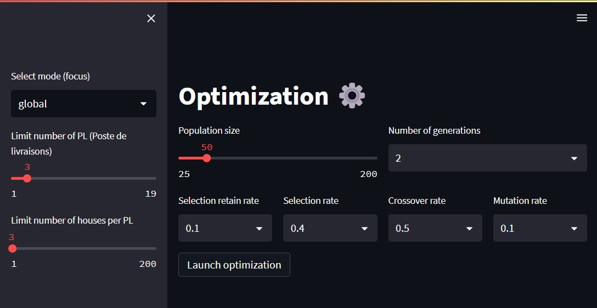
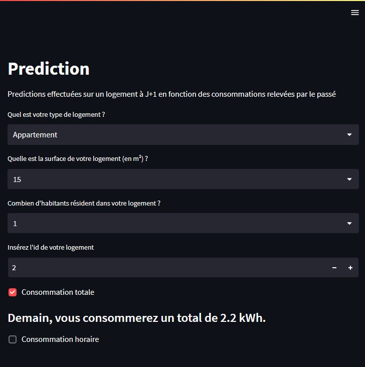

# Power consumption 📅🔌

Project in collaboration with [SPIE](https://www.spie.com/fr) 🇫🇷🔌.

## Objective

1. **Predict** the electrical consumption of a house according to its characteristics.
2. **Optimize** the scheduling of electrical activities of the house to reduce its electrical consumption.

## Results

### Optimization App



### Prediction App



## Requirements

````
pip install -r requirements.txt
````

## Execution

1. Make sure you have installed the above prerequisites
2. Download or clone this repository to your computer
3. Open a terminal and go to the application directory
4. Run the commands :
    - `streamlit run app_optimization.py` for optimization
    - `streamlit run app_prediction.py` for prediction

You should now see the application running 🚀 !

## Authors

- Mlamali SAID SALIMO
- Maxime GARDERE
- Maël TREVIN
- Lionel OBAME NGOUA
